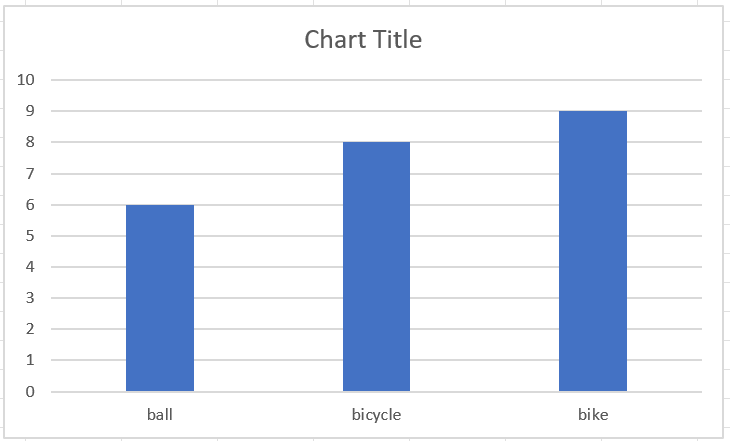

# Hollywood's Most Profitable Stories — Simple Analysis

## Project Overview

This project provides a simple exploratory analysis of the **Hollywood's Most Profitable Stories** dataset. The dataset contains information about films, including genre, lead studio, audience score, profitability, Rotten Tomatoes score, worldwide gross, and release year.

The goal of the analysis is to identify basic patterns in **film profitability, genre performance, audience reception, and worldwide gross**.

## Dataset

- **Records:** 74
- **Columns:** 8
- **Year range:** 2007–2011
- **Duplicate rows:** 0
- **Source file:** `HollywoodsMostProfitableStories.csv`

### Columns

| Column | Description |
|---|---|
| `Film` | Film title |
| `Genre` | Film genre |
| `Lead Studio` | Studio associated with the film |
| `Audience score %` | Audience rating percentage |
| `Profitability` | Profitability measure provided by the dataset |
| `Rotten Tomatoes %` | Rotten Tomatoes rating percentage |
| `Worldwide Gross` | Worldwide box-office gross |
| `Year` | Release year |

## Key Findings

### 1. Genre distribution

Comedy is by far the most represented genre:

| Genre | Number of Films |
|---|---:|
| Comedy | 41 |
| Romance | 15 |
| Drama | 13 |
| Animation | 3 |
| Action | 1 |
| Fantasy | 1 |

Comedy accounts for more than half of the films in the dataset, so comparisons involving genre should consider this imbalance.

### 2. Average profitability by genre

Based on the available profitability values, **Drama has the highest average profitability**.

| Genre | Films | Avg. Profitability | Avg. Worldwide Gross |
|---|---:|---:|---:|
| Drama | 13 | 8.41 | 99.01 |
| Romance | 15 | 4.37 | 133.54 |
| Comedy | 41 | 3.94 | 130.50 |
| Animation | 3 | 3.22 | 356.78 |
| Fantasy | 1 | 1.78 | 285.43 |
| Action | 1 | 1.25 | 93.40 |

**Important:** Some genres have very few films, so their averages should not be treated as strong evidence of general genre performance.

### 3. Most profitable films

The five films with the highest recorded profitability are:

| Film | Genre | Profitability | Worldwide Gross | Year |
|---|---|---:|---:|---:|
| Fireproof | Drama | 66.93 | 33.47 | 2008 |
| High School Musical 3: Senior Year | Comedy | 22.91 | 252.04 | 2008 |
| The Twilight Saga: New Moon | Drama | 14.20 | 709.82 | 2009 |
| Waitress | Romance | 11.09 | 22.18 | 2007 |
| Twilight | Romance | 10.18 | 376.66 | 2008 |

The highest recorded profitability is **66.934**, achieved by **Fireproof**.

The lowest recorded profitability is **0.005**, recorded for **Waiting For Forever**.

### 4. Overall averages

| Measure | Average |
|---|---:|
| Profitability | 4.74 |
| Audience Score | 64.14% |
| Rotten Tomatoes Score | 47.36% |
| Worldwide Gross | 136.35 |

The median profitability is **2.64**, which is considerably lower than the mean. This suggests that a small number of highly profitable films have a strong effect on the average.

### 5. Profitability and worldwide gross

The dataset shows only a **weak positive relationship** between profitability and worldwide gross (correlation ≈ **0.15**).

This is an important observation: a film can generate a large worldwide gross without necessarily being highly profitable. Profitability is influenced by factors beyond revenue, such as production and marketing costs.

### 6. Data quality

The dataset contains a small amount of missing information:

- `Lead Studio`: 1 missing value(s)
- `Audience  score %`: 1 missing value(s)
- `Profitability`: 3 missing value(s)
- `Rotten Tomatoes %`: 1 missing value(s)

There are no duplicate rows in the dataset.

For a more advanced analysis, missing values should be handled explicitly before calculating statistics or building visualisations.

## Suggested Visualisations

A dashboard or portfolio analysis could include:

1. **Bar chart:** Number of films by genre.
2. **Bar chart:** Average profitability by genre.
3. **Scatter plot:** Worldwide Gross vs. Profitability.
4. **Scatter plot:** Audience Score vs. Profitability.
5. **Bar chart:** Top 10 most profitable films.
6. **Line chart:** Average profitability by year.
7. **Bar chart:** Number of films by lead studio.

## Simple Interpretation

The dataset suggests that:

- **Drama has the highest average profitability** among the represented genres.
- **Comedy dominates the dataset by volume**, making it the most common genre in this sample.
- A small number of films have exceptionally high profitability, pulling the mean above the median.
- **Worldwide gross alone is not a strong predictor of profitability** in this dataset.
- Audience and Rotten Tomatoes scores do not show a strong direct relationship with profitability in this simple analysis.
- Genre-level conclusions should be treated cautiously because some genres contain only one or a few films.

## Limitations

This is a **descriptive analysis**, not a causal study. The dataset covers a relatively small sample of films and an uneven distribution of genres and studios.

The profitability field is also a dataset-specific metric; it should not automatically be interpreted as the same thing as accounting profit.

A stronger project could investigate:

- Production budget versus gross revenue
- Profitability trends over time
- Studio-level performance
- Relationship between critic/audience scores and profitability
- Outlier films
- Genre and studio combinations
- Predictive modelling of profitability

## Tools

This analysis can be reproduced using:

- **Python**
- **Pandas**
- **Jupyter Notebook**
- **Matplotlib / Seaborn** for visualisation

## Conclusion

The **Hollywood's Most Profitable Stories** dataset provides a useful starting point for exploring relationships between film characteristics, audience reception, box-office performance, and profitability.

The main takeaway from this simple analysis is that **high worldwide gross does not necessarily translate directly into high profitability**. The data also highlights the importance of considering sample size and outliers when comparing genres.

---

*README generated from `HollywoodsMostProfitableStories.csv` using a simple exploratory analysis.*
